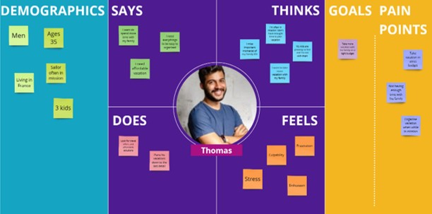

Assignment #1 - Marie Giacomel (40321702) - Concordia University Montreal - SOEN 357 - 2024-2025

 <!-- Remplace par l'URL de ton image de bannière -->

# Creation Process

## 🌟 Introduction
## 🚀 Understanding the Problem
## 🌟 Fonctionnalities
## 💡 Research & Analysis

## 📫 Personsas
### Thomas Bouchard

  

### Aiko Sato

  

## 🌟 Empathize Map
### Thomas Bouchard

  

### Aiko Saito

  

## 🌟 User Journey
## 🌟 Story Board
## 🌟 Sketches
## 🌟 User Flow
## 🌟 Wireframes

  
  
  
  

## 🌟 Style
### Inspiration

  
  
  
  

## 🌟 Final Result
## 🌟 Conclusion
